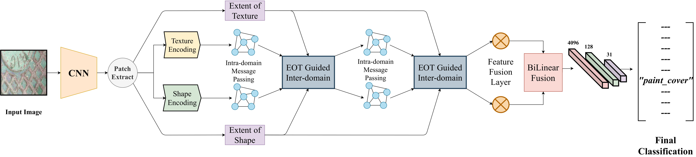
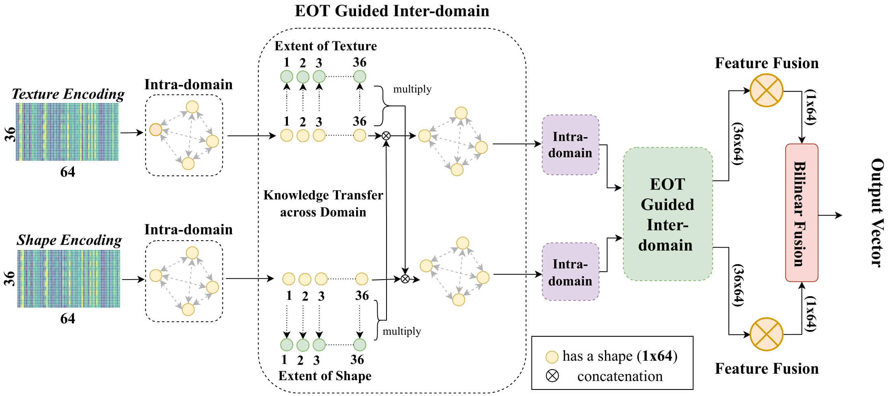

# Ground Terrain Recognition Modelling Extent of Texture Information [[paper](https://arxiv.org/abs/2004.08141)]
**Shuvozit Ghose**, Pinaki Nath Chowdhury, Partha Pratim Roy, Umapada Pal

## Abstract
Ground Terrain Recognition is a difficult task as the context information varies significantly over the regions of a ground terrain image. In this paper, we propose a novel approach towards ground-terrain recognition via modeling the Extent-of-Texture information to establish a balance between the order-less texture component and ordered-spatial information locally. At first, the proposed method uses a CNN backbone feature extractor network to capture meaningful information of a ground terrain image, and model the extent of texture and shape information locally. Then, the order-less texture information and ordered shape information are encoded in a patch-wise manner, which is utilized by intra-domain message passing module to make every patch aware of each other for rich feature learning. Next, the Extent-of-Texture (EoT) Guided Inter-domain Message Passing module combines the extent of texture and shape information with the encoded texture and shape information in a patch-wise fashion for sharing knowledge to balance out the order-less texture information with ordered shape information. Further, Bilinear model generates a pairwise correlation between the order-less texture information and ordered shape information. Finally, the ground-terrain image classification is performed by a fully connected layer. The experimental results indicate superior performance of the proposed model over existing state-of-the-art techniques on publicly available datasets like DTD, MINC and GTOS-mobile.


### Architecture


### Message Passing


## Citation
If you find this work useful in your research, please consider citing: 
```
@article{ghose2020modeling,
  title={Modeling Extent-of-Texture Information for Ground Terrain Recognition},
  author={Ghose, Shuvozit and Chowdhury, Pinaki Nath and Roy, Partha Pratim and Pal, Umapada},
  journal={arXiv preprint arXiv:2004.08141},
  year={2020}
}
```
